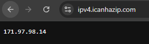
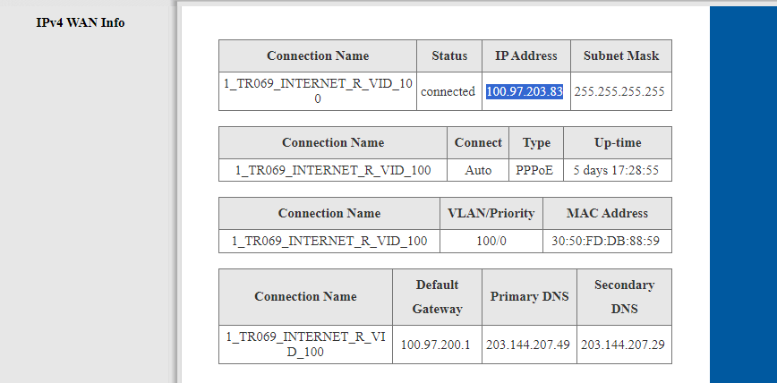

# debserver

## Making HTTPS 
### Problem ip router ไม่ตรง

เพราะไอทีเร้าเตอร์ 100.xx นั่นมันไม่ใช่ Public IP ดังนั้น ถ้าได้ไอพี 100.xx นี้ noip ไม่สามารถติดต่อกับเร้าเตอร์ได้
มันคือ Large Scale NAT https://www.blognone.com/node/54298

จะถือว่าเป็น Private IP ก็ได้แต่ไม่ใช่  IP Private ที่เราใช้กันในวง LAN (RFC1918)
![[Pasted image 20240808003029.png]]
http://en.wikipedia.org/wiki/Carrier-grade_NAT

ตามรูป  
IP Private ที่เราใช้กันในวง LAN (RFC1918)
10.0.0.0 - 10.255.255.255    
172.16.0.0 - 172.31.255.255
192.168.0.0 - 192.168.255.255

ส่วน IP 100.64.0.0 - 100.127.255.255   IANA assign ให้ใช้ใน Large Scale NAT (RFC6598)
ซึ่งก็คงมีแต่ ISP ที่ใช้กันครับ  (ปกติบ้านเราไม่ค่อยเห็น IP ประเภทนี้เพราะ IP Public มันจะหมดเขาก็เลยเอามาใช้ครับ -ตามข่าว blognon)
ดังนั้นทั่วโลกมันก็อาจซ้ำกันเหมือนกัน Private IP 192.168.0.x ของเราเลยครับ  ดังนั้น IP US จากเว็บเช็คไอพี

### True internet resource
- https://pantip.com/topic/38178326
- https://pantip.com/topic/331256

### DNS provider
https://www.duckdns.orgmains